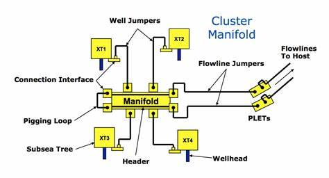

# Data Scientist

Environnements techniques : Python, R, SQL, PowerBI

# Expérience
**Consultante Data Scientist @ Lincoln ( Août 2024 - maintenant)**

*- Data scientist @ La Poste*

    - Ciblage des clients
    - Mettre en place un modèle de scoring 
    - Analyse statistique des données
    - Forage des données dans Dataiku
    - Déploiement du modèle dans Dataiku
      
**Data scientist @ TotalEnergies (2023 - 2024)**
- Extraction des données sur PI VISION
- Traitement des données : les valeurs manquantes, abérrantes, feature engineering
- Développement de modèles prédictifs pour la détection d'anomalies
- Conception d'ienterfaces utilisateurs dynamiques avecc Dash de Python
- Gestion de projet, rédaction de rapport & vulgarisation des résultats
  

**Data scientist @ Visions (2021 - juillet 2022)**
- Extraction des données (DB mongoDB)
- Analyse exploratoire des données
- Transformation des données (features engineering)
- Développement de modèles de prédiction du consentement
- Elaboration et présentation des résultats

# Formation
- Master 2 Data science | Université Paris-Saclay (2019 - 2020)
- Master 1, Ingénierie Mathématique et Biostatistique | Université Paris Descartes (2018 - 2019)
- Licence 3, Mathématiques appliquées | Université Paris Descartes (2017 - 2018)

# Projets Personnels & Universitaire

